## 1. 高层摘要 (TL;DR)

*   **影响**: **中等** - 本次变更主要涉及后端业务逻辑优化、Session 异常处理增强，以及前端从 Webpack 迁移到 Vue CLI 构建工具。
*   **核心变更**:
    *   🔧 **生产厂家查询优化**: 重构参数处理逻辑，增加参数校验和空值保护
    *   💊 **库存控制修复**: 支持拆零销售的库存计算逻辑
    *   📋 **处方状态联动**: 处方保存时自动更新检验检查状态
    *   🛡️ **Session 异常处理**: 增强工具类异常处理能力，防止 Session 过期导致崩溃
    *   📦 **构建工具升级**: 前端从 Webpack 3 迁移到 Vue CLI 5

---

## 2. 可视化概览 (代码与逻辑映射)

```mermaid
graph TD
    subgraph "生产厂家管理"
        A["ManufactureFactoryService.listAlls()"]
        B["参数校验<br/>company_id"]
        C["过滤参数列表"]
        D["DAO查询"]
        A --> B --> C --> D
    end
    
    subgraph "库存控制"
        E["MedicinalStorageControlService<br/>预占用库存"]
        F["判断拆零销售<br/>isUnpackSell"]
        G["单位转换<br/>包装→制剂"]
        H["库存校验"]
        E --> F --> G --> H
    end
    
    subgraph "处方业务"
        I["RecipelDetailService<br/>保存处方"]
        J["更新挂号就诊日期"]
        K["获取检验检查列表"]
        L["批量更新状态为已填写"]
        I --> J --> K --> L
    end
    
    subgraph "Session工具类"
        M["SessionUtils"]
        N["getUserJson()"]
        O["getUserDto()"]
        P["setUserJson()"]
        Q["try-catch包装"]
        M --> N
        M --> O
        M --> P
        N --> Q
        O --> Q
        P --> Q
    end
    
    style A fill:#bbdefb,color:#0d47a1
    style E fill:#fff3e0,color:#e65100
    style I fill:#c8e6c9,color:#1a5e20
    style M fill:#f3e5f5,color:#7b1fa2
```



---

## 3. 详细变更分析

### 3.1 后端业务逻辑优化

#### 🔧 生产厂家查询服务 (`ManufactureFactoryService.java`)

**变更说明**:
重构了 `listAlls` 方法，修复了参数处理逻辑中的潜在问题。

| 变更项 | 旧实现 | 新实现 |
|--------|--------|--------|
| 参数过滤 | 直接 `remove(0)` 删除第一个参数 | 使用 `stream().filter()` 过滤 `company_id` |
| 参数校验 | 无校验，直接调用 `get()` | 使用 `isPresent()` 校验后抛出异常 |
| 原列表修改 | 直接修改传入的 `parameters` | 创建新的 `filteredParameters` 列表 |
| 代码注释 | 无注释 | 添加详细的方法和步骤注释 |

**关键代码片段**:
```java
// 新增参数校验
if (!companyOptional.isPresent()) {
    throw new IllegalArgumentException("Missing required parameter: company_id");
}

// 创建新参数列表，避免修改原列表
List<Parameter> filteredParameters = parameters.stream()
        .filter(item -> !item.getColumnName().equals("`company_id`"))
        .collect(Collectors.toList());
```

---

#### 💊 库存控制服务 (`MedicinalStorageControlService.java`)

**变更说明**:
修复了库存预占用逻辑，支持拆零销售的库存计算。

| 变更项 | 说明 |
|--------|------|
| 单位转换逻辑 | 新增：当 `isUnpackSell == 0` 时，将包装单位转换为制剂单位 |
| 转换公式 | `total = total × preparation` (制剂数量) |
| 验证时机调整 | 将负数和零值校验移到单位转换之后 |
| 注释优化 | 将中文注释规范化 |

**关键代码片段**:
```java
// 根据是否拆零销售判断总量单位
BigDecimal totalBigDecimal = new BigDecimal(recipelDetail.getTotal());
// 如果不拆零销售，total 是包装单位，需要转换为制剂单位
if (recipelDetail.getIsUnpackSell() != null && recipelDetail.getIsUnpackSell() == 0) {
    if (drug != null && drug.getPreparation() != null) {
        totalBigDecimal = totalBigDecimal.multiply(new BigDecimal(drug.getPreparation()));
    }
}
```

---

#### 📋 处方详情服务 (`RecipelDetailService.java`)

**变更说明**:
在处方保存成功后，自动更新该处方下所有检验检查的状态为"已填写"。

| 变更项 | 说明 |
|--------|------|
| 新增依赖 | `InspectionCheckService` |
| 新增导入 | `InspectionCheck` 实体类、`CollectionUtils` 工具类 |
| 业务逻辑 | 在两处处方保存逻辑中添加检验检查状态更新 |

**关键代码片段**:
```java
// 更新该处方下所有检验检查状态为已填写
List<InspectionCheck> inspectionChecks = inspectionCheckService.getByRecipelInfoId(recipelInfo.getId());
if (!CollectionUtils.isEmpty(inspectionChecks)) {
    for (InspectionCheck inspectionCheck : inspectionChecks) {
        inspectionCheck.setStatus("1");
        inspectionCheckService.save(inspectionCheck);
    }
}
```

---

### 3.2 Session 工具类异常处理增强

#### 🛡️ SessionUtils (两个版本)

**变更说明**:
为所有 Session 相关方法添加 `try-catch` 异常处理，防止 Session 过期或不存在时抛出异常导致系统崩溃。

| 方法 | 变更类型 | 异常处理策略 |
|------|----------|--------------|
| `getUserJson()` | 读取 | 捕获异常返回 `null` |
| `getUserDto()` | 读取 | 捕获异常返回 `null` |
| `getUserJson(Session)` | 读取 | 新增空值检查 + 捕获异常 |
| `setUserJson()` | 写入 | 捕获异常静默处理 |
| `getUserPermission()` | 读取 | 捕获异常返回 `null` |
| `setUserPermission()` | 写入 | 捕获异常静默处理 |
| `getWeChatUser()` | 读取 | 捕获异常返回 `null` |
| `setWeChatUser()` | 写入 | 捕获异常静默处理 |
| `getUser()` | 读取 | 新增空值检查 |
| `setLoginTenantId()` | 写入 | 捕获异常静默处理 |
| `setLoginTenant()` | 写入 | 捕获异常静默处理 |
| `getLoginTenantId()` | 读取 | 捕获异常返回 `null` |
| `getLoginTenant()` | 读取 | 捕获异常返回 `null` |

**关键代码示例**:
```java
// 读取方法示例
public static JSONObject getUserJson(){
    try {
        return (JSONObject)SecurityUtils.getSubject().getSession().getAttribute(SESSION_USER_INFO);
    } catch (Exception e) {
        return null;
    }
}

// 写入方法示例
public static void setUserJson(JSONObject userObj ){
    try {
        SecurityUtils.getSubject().getSession().setAttribute(SESSION_USER_INFO, userObj);
    } catch (Exception e) {
        // Session 已过期或不存在
    }
}
```

---

### 3.3 配置文件变更

#### 📝 应用配置 (`application-demo.yml`)

| 配置项 | 旧值 | 新值 | 说明 |
|--------|------|------|------|
| **服务端口** | `9016` | `7016` | 服务端口变更 |
| **数据库URL** | `61.172.179.48:19011/medical2.0` | `61.172.179.73:5011/md_yzs20250331` | 数据库迁移 |
| **数据库用户** | `new_touch` | `root` | 用户变更 |
| **数据库密码** | `bW9Ivzt0CAQdoJTDZ2wAnduvi` | `xZ_TTSL123` | 密码更新 |
| **Redis主机** | `61.172.179.48` | `127.0.0.1` | 切换到本地 |
| **Redis端口** | `19012` | `6379` | 使用默认端口 |
| **JWT过期时间** | `3600000` (1小时) | `36000000` (10小时) | 延长会话时间 |
| **报表后端** | `localhost` | `localhostx` | 配置变更 |
| **RabbitMQ** | 已配置 | 已注释 | 移除消息队列配置 |
| **启信宝配置** | 已配置 | 已注释 | 移除第三方服务 |
| **企业微信配置** | 已配置 | 已注释 | 移除第三方服务 |

---

#### 🚫 Git 忽略规则 (`.gitignore`)

| 新增规则 | 说明 |
|----------|------|
| `.vs/` | Visual Studio 配置目录 |
| `.trae/` | Trae 工具配置目录 |
| `.history/` | 文件历史记录目录 |

---

### 3.4 前端构建工具升级

#### 📦 依赖管理 (`package.json`)

**构建工具迁移**: 从自定义 Webpack 配置迁移到 Vue CLI 5

| 构建脚本 | 旧命令 | 新命令 |
|----------|--------|--------|
| 开发环境 | `webpack-dev-server` | `vue-cli-service serve --no-eslint` |
| 生产构建 | `node build/build.js` | `vue-cli-service build` |
| 代码检查 | 无 | `vue-cli-service lint` |
| 单元测试 | `jest` | `vue-cli-service test:unit` |

**依赖变更摘要**:

| 类别 | 移除依赖 | 新增依赖 |
|------|----------|----------|
| **构建核心** | `webpack@3.6.0`, `webpack-dev-server@2.9.1` | `webpack@5.105.4`, `@vue/cli-service@5.0.9` |
| **Babel** | `babel-core@6.x`, `babel-loader@7.x` | `@babel/core@7.29.0`, `@vue/cli-plugin-babel@5.0.9` |
| **工作流** | `bpmn-js@2.5.1`, `bpmn-js-properties-panel@0.33.1` | (已移除) |
| **测试** | `jest@21.2.0`, `nightwatch@0.9.12` | `@vue/cli-plugin-unit-jest@5.0.9` |
| **代码检查** | 无 | `eslint@10.2.0`, `eslint-plugin-vue@10.8.0` |
| **其他** | `extract-text-webpack-plugin`, `uglifyjs-webpack-plugin` | `docx@9.6.1` |

---

## 4. 影响与风险评估

### ⚠️ 破坏性变更

| 变更项 | 影响范围 | 风险等级 |
|--------|----------|----------|
| **数据库连接配置** | 后端服务启动 | 🔴 高 |
| **JWT 过期时间延长** | 用户会话管理 | 🟡 中 |
| **前端构建工具迁移** | 前端构建流程 | 🟡 中 |
| **Session 异常处理** | 所有依赖 Session 的功能 | 🟢 低 (正向改进) |
| **库存计算逻辑** | 药品库存控制 | 🟡 中 |

### 🧪 测试建议

#### 后端测试
1. **生产厂家查询**: 
   - 测试缺少 `company_id` 参数时是否抛出异常
   - 测试参数过滤是否正确

2. **库存控制**:
   - 测试拆零销售 (`isUnpackSell = 0`) 的库存计算
   - 测试不拆零销售 (`isUnpackSell = 1`) 的库存计算
   - 验证负数和零值的校验逻辑

3. **处方业务**:
   - 验证处方保存后检验检查状态是否正确更新为 "1"
   - 测试无检验检查时的处理逻辑

4. **Session 异常处理**:
   - 模拟 Session 过期场景，验证是否返回 `null` 而非抛出异常
   - 测试所有 Session 读写方法的异常处理

#### 前端测试
1. **构建验证**:
   - 运行 `npm run dev` 验证开发环境启动
   - 运行 `npm run build` 验证生产构建
   - 运行 `npm run lint` 验证代码规范

2. **功能验证**:
   - 验证工作流相关组件是否正常加载
   - 检查第三方库 (echarts, element-ui) 的引用

---

## 5. 总结

本次变更主要聚焦于 **后端业务逻辑优化** 和 **前端构建工具现代化**：

✅ **正向改进**:
- 增强了 Session 工具类的健壮性，防止异常导致系统崩溃
- 修复了库存计算中的拆零销售逻辑缺陷
- 优化了生产厂家查询的参数处理和校验
- 前端构建工具升级到 Vue CLI 5，提升开发体验

⚠️ **注意事项**:
- 数据库配置已变更，需要确保新数据库环境已准备就绪
- JWT 过期时间延长至 10 小时，需评估安全影响
- 前端构建流程变更，开发团队需要更新构建文档